# rsi-multi-harness-rl

**Recursive self-improvement for agentic RL: the tasks, the reward, and the
harness are all built by the system, then checked by gates that can fail.**

A policy is trained inside an *agent harness*. This repository asks what happens
when the harness is not a fixed product decision — when the system **generates
its own tasks, writes its own reward function, and evolves its own harness**,
keeping only the changes that clear a measured noise floor.

Three things are self-constructed here, and each one is validated rather than
asserted:

| axis | built by | checked by | evidence |
| --- | --- | --- | --- |
| **task** | `rsi/task_gen.py` | gates V1–V4 | `outputs/rsi/validation.json` |
| **reward** | `rsi/verifier_gen.py` | V1 never fires / V2 always fires | same artifact, per-gate |
| **harness** | `rsi/harness_evolve.py` | noise floor + tool-surface guard | `outputs/rsi/ledger.jsonl` |

[中文说明](README.zh-CN.md)

---

## Why this is the hard part

An agentic policy is trained inside a *harness*: a system prompt, a tool set, and
a submit protocol. The harness is normally treated as a product decision made
after training — you train the model, then wrap it in Claude Code, or Codex, or
your own scaffold.

That framing hides a failure mode. If a policy is only ever trained inside one
harness, it can satisfy the reward by memorizing that harness's interface rather
than by understanding the task. The reward goes up; the capability does not
transfer. Then the scaffold changes and the policy has to be retrained.

Xiaomi's MiMo-V2.6 technical report makes this argument directly. §4.2.5 trains
across multiple harnesses, on the reasoning that open-source users build their
own harnesses rather than converging on one, and the release notes state that
multi-harness training improves *"the model's generalization ability across
different frameworks, including unseen ones."* Reported effect: replacing the
harness with ones never seen in training (Codex, Claude Code, mini-swe-agent)
moved average pass rate from roughly 50% to 66%.

Reproducing that on one laptop GPU requires solving a prior problem: **a fixed
task suite and a hand-written reward cannot answer a question about generality**,
because whatever the suite happens to cover is what gets measured. So the
repository builds the curriculum, the reward, and the scaffold itself — and then
tries hard to falsify each one.

## Axis 1 — the task is generated, not maintained

`rsi/task_gen.py` samples from an explicit parameter space and emits a complete
trial: environment, task, reward, and a reference solution.

| parameter | values | what it controls |
| --- | --- | --- |
| `tier` | T1 / T2 / T3 / T4 | the difficulty family |
| `payload_len` | 1, 2, 4, 8, 16 | how much text must survive the round trip |
| `escape_density` | 0.0, 0.15, 0.35, 0.6 | how much shell quoting is needed |
| `steps` | 1, 2, 3 | how many transformations before writing |
| `read_source` | false, true | content in the prompt, or on disk |
| `verify_mode` | `file_equals` / `file_contains` / `python_exit` | how the result is graded |

Every function is a pure function of its parameters and a seed, so the same seed
produces byte-identical tasks. That is what lets CI re-derive the suite and
compare it against the artifact that was actually trained on.

**A hand-written "easy tier" was tried and rejected.** The first design for this
work added a hand-written T2-lite tier to fill cells the scan had found empty. A
hand-written tier is a human maintaining a curriculum, which is the thing RSI is
supposed to replace. The generator produces the same coverage by parameter, and
can produce more of it on demand.

## Axis 2 — the reward is generated, and it can be wrong in two ways

`rsi/verifier_gen.py` turns an expected answer into a reward. A generated reward
has exactly two failure modes, and both are gates rather than review comments:

* **it never fires** — the reference solution does not score 1.0, so the task is
  unsolvable and every rollout is wasted (gate **V1**);
* **it always fires** — an empty directory scores 1.0, so the task measures
  nothing and the policy learns to submit nothing (gate **V2**).

A third case is subtler and is handled by construction rather than by a gate.
`check_script` is a **filename**, not source: `core.verify` runs
`python <check_script>` with the work directory as cwd, and `setup` is the only
mechanism that puts a file there. That places the checker inside the agent's
reach, so the generated checker stores a **SHA-256** rather than the plaintext
answer. Which in turn means the **substring reward cannot be a digest** —
testing containment needs the needle — so it lives in the `file_contains` mode,
where the comparison happens in the harness process and nothing is written to
disk. `check_script_source` raises rather than emitting a checker that cannot
work:

| strength | mode | why |
| --- | --- | --- |
| `exact` | `file_equals` | comparison in-process; nothing enters the sandbox |
| `normalised` | `python_exit` | needs a property, not a string |
| `substring` | `file_contains` | **a digest cannot test containment** |

And because a short answer graded by `python_exit` would ship a brute-forceable
digest, the generator consults `recommend_mode` rather than trusting its own
parameter vector. On a 300-task batch, 96 (32%) were demoted before this rule
was wired in; 0 are now, and `python_exit` stays reachable for long answers.
That 96 is seed 0 — the rate is seed-dependent but concentrated, 79–99 out of
300 across eight seeds, and `--seed` defaults to 11, which gives 91. The seed is
stated because a rate without one is not reproducible.

## Axis 3 — the harness is evolved, against a measured noise floor

`rsi/harness_evolve.py` searches over eight named descriptor edits, each of which
is a *hypothesis about why the policy fails*:

| edit | component | hypothesis |
| --- | --- | --- |
| `guidance+=submit_echo` | prompt | writes the file but never verifies its content |
| `guidance+=retry_hint` | prompt | stops after one failed call |
| `guidance+=exactness` | prompt | appends prose to an exact-match answer |
| `guidance+=one_line` | prompt | writes a sentence when a value was wanted |
| `prompt-=verbose_preamble` | prompt | guidance asking for reasoning spends the turn budget on prose |
| `output_plumbing+=explicit_path` | output_plumbing | writes to the wrong path or a nested directory |
| `client_tool-=read_file` | client_tool | an unused tool costs context and invites stray calls |
| `context_mgmt+=keep_last_error` | context_mgmt | repeats a call that already failed |

Four design commitments make this a search rather than a random walk:

**A candidate must beat the incumbent by more than the noise floor.** The floor
is `z · √2 · se` with `z = 2`, pooled across cells, adapted from RRSI's
`calibrate.py`. Without it an evolutionary loop hill-climbs on sampling error
indefinitely. The ledger separates `rejected_within_noise` from `rejected_worse`
— a distinction that matters, because "we could not tell" and "it was worse" are
different findings.

**The edit budget is annealed.** `b_t = ceil(b_min + (b_max − b_min)·½(1 + cos(πt/T)))`
bounds `‖z_t‖₀`, the number of independent edits in one proposal. It is not a
step size and not a score threshold. For `T=12, b_min=1, b_max=3` the schedule is
`[3,3,3,3,3,3,2,2,2,2,2,2]`.

**Novelty counts structural components only.** A harness whose guidance was
reworded five times has not explored five regions; rewarding that would push the
loop to keep rewriting prose instead of changing the interface. Structural here
means `client_tool` and `output_plumbing` — the components that change what the
agent *can do* rather than what it is *told*.

**Every attempt is recorded, and pruning is on zero yield.** RRSI records one
entry per accepted edit and reconstructs the rest. The edit space here is small,
so rejections carry proportionally more information: "this whole neighbourhood is
exhausted" is only visible if the failures are in the ledger. A component is
pruned only when it has been attempted at least `min_attempts` times **and has
never once been accepted** — a yield threshold would discard a component that
works occasionally, which is exactly the mistake the statistics layer exists to
correct.

The result is a JSONL ledger that is a test of each hypothesis rather than a
score: 30 edits attempted, 10 accepted, and `context_mgmt` pruned for zero yield
across every attempt.

**Those numbers come from `--score ledger-replay`, and the artifact says so.**
`scripts/rsi_loop.py` has two scoring modes and the distinction is recorded under
`score_mode` in `outputs/rsi/harness.json`:

| mode | what scores a candidate | what the number means |
| --- | --- | --- |
| `ledger-replay` | a deterministic stand-in function | exercises the budget, guard, floor, ledger and prune rule **without a GPU** |
| `rollout` | the model, rolled out on the task batch | the honest harness number |

Replayed mode exists so the loop's machinery can be run and tested on the machine
CI runs on, which has no GPU. It is **not** a model measurement, and reading the
trajectory `[0.471, 0.528, 0.528, …]` as "the harness got better" would be
wrong — it is a synthetic curve whose only job is to reach every branch of the
loop. The noise floor in the replayed artifact is labelled `fixed fallback` for
the same reason: a single score per state cannot support a bootstrap floor.

**The `rollout` arm has now been run, and its first output is a correction to the
table above.** The four trainable harnesses, scored by the *unmodified* base
model over the same 30 generated tasks × 8 rollouts, come out at:

| harness | measured baseline | replayed stand-in |
| --- | --- | --- |
| `bash_minimal` | **0.008** | 0.25 |
| `react_tools` | **0.054** | 0.25 |
| `json_strict` | **0.029** | 0.25 |
| `longctx_summary` | **0.029** | 0.25 |

Every real score is **3–30× below** the `0.25` the stand-in assumed for all four,
and the stand-in gave all four the *same* number while the real harnesses differ
by nearly 7×. So the replayed trajectory was not merely uninformative about
whether the harness improved — it was built on a base rate that is wrong by an
order of magnitude, which is why the accepted edits in that run look like they
"improved" something from 0.471 to 0.528. Those numbers describe the stand-in
function, not a harness.

**The noise floor moves too, and in the other direction.** Bootstrapped from the
measured rollouts it comes out at **0.0176**, against the `0.05` the replayed
mode falls back to — a factor of 2.8. So the synthetic run was simultaneously
starting from a base rate ~8× too high *and* demanding a margin ~3× too large
before accepting an edit. Neither number was measured, both decided every accept
in that run, and they erred in opposite directions — which is why the replayed
result looked plausible rather than obviously broken.

The measured baseline is also the honest context for the ablation: ~0.03 is what
an untrained 0.5B model scores when scored by this harness pool on generated
tasks, which is consistent with the 0.1406 the shipped suite gives it on the
train harnesses — generated tasks are harder, as gate V4 intends them to be.
The full measured evolution is still running; when it lands, `outputs_rollout/`
carries `score_mode: rollout` and fig10 is drawn from that ledger instead.

## The gates, and why there are four

A generated task is not trusted until it survives all four. They are applied to
*every* task, every run, rather than asserted by convention.

| gate | question | failure it catches |
| --- | --- | --- |
| **V1** oracle | does the reference solution score 1.0? | mis-specified task |
| **V2** nop | does an empty directory score 0.0? | a reward that always fires |
| **V3** safety | is the `check_script` actually shipped in `setup`? | a checker that never exists at reward time |
| **V4** cross-harness | solvable on **every** trainable harness, and **not identical** across them | a task measuring harness completeness, or one carrying no harness-axis information |

**V4 is the gate neither reference system needs**, and it is the reason this
repository exists. RRSI evolves harnesses against a *fixed* task set; SPADE
generates environments against a *fixed* agent. Varying both forces two
conditions at once: a task must be solvable on all four trainable harnesses, or a
low score on one cell measures that harness's completeness rather than the
policy's skill — and it must *not* score identically on all of them, or it
carries no information about the axis under test.

Measured on a generated batch of 30: **30 accepted, 0 rejected**, across T1 13,
T2 6, T3 3, T4 8 — with 19 tasks carrying a source file and modes split
`file_equals` 17 / `file_contains` 12 / `python_exit` 1.

The batch's parameter vector *requested* `file_equals` 10 / `file_contains` 12 /
`python_exit` 8. The two distributions differ by **7 overrides**, and that gap is
the fix for the brute-forceable-digest defect described below: every demoted task
asked for `python_exit` on an answer too short to survive being digested, and the
generator now consults `recommend_mode` instead of trusting the vector it drew.
The artifact records both counts side by side precisely so the gap stays visible —
a single "modes used" table would have hidden the correction that produced it.

## Design commitments for the measurement

**The verifier is harness-agnostic.** Grading reads only `<workdir>/answer.txt`.
The grader cannot tell which scaffold produced an answer, so a difference in score
cannot be an artifact of grading. The harnesses differ in *how* an answer is
submitted — `react_tools` has a `finish` tool, `json_strict` has `submit` — and a
model that only learned "write the file with bash" cannot score on those without
adapting. That is the signal under test.

**Harnesses differ structurally, not cosmetically.** Five harnesses, differing in
tool set and submit protocol:

| harness | tools | submit | role |
| --- | --- | --- | --- |
| `bash_minimal` | `bash` | write the file | train |
| `react_tools` | `bash`, `read_file`, `write_file`, `finish` | `finish()` tool | train |
| `json_strict` | `bash`, `submit` | `submit()` tool | train |
| `longctx_summary` | `bash`, `read_file`, `replace_in_file` | write the file | train |
| `codex_style` | `bash`, `apply_patch` | write the file | **held out** |

**Two axes are held out, not one.** Splitting only the harness would let the
model memorize the tasks and still look like it generalized; splitting only the
tasks would leave the harness axis untested. So the task suite is split 16/8 and
`codex_style` never appears in training at all.

**A capability probe gates the GPU spend.** Before training, four gates establish
that the base model can drive the harness pool at all. If it cannot, any gap
measured afterwards is noise, and the honest output is "no result" rather than a
number.

| gate | threshold | measured (n=32) | verdict |
| --- | --- | --- | --- |
| G1 tool-call rate | ≥ 50% | **77.3%** of 2,048 rollouts | pass |
| G2 reachable cells (pass@32) | ≥ 1 | **42 of 64** | pass |
| G3 cross-harness spread | > 0 | **0.72** | pass |
| G4 multi-turn uptake | ≥ 50% | **100%** of 1,584 tool-calling rollouts | pass |

**Go/No-Go: GO.** Qwen2.5-0.5B-Instruct can drive the four trainable harnesses.
Mean turns 1.78, mean tool calls 1.04.

The probe covers the trainable pool only — `scripts/probe.py` resolves names
through `TRAIN_HARNESSES`, so `codex_style` is not reachable from it. That is
deliberate rather than an oversight: the held-out harness is the measurement's
dependent variable, and a capability gate that tuned itself against it would
spend the thing being measured. It does mean this gate says nothing about
`codex_style`, and the eval later showed it scores `0/32` there — so "GO" is a
statement about the four harnesses training can see, not about all five.

## What the measurement actually found

The headline ablation has now been run — see **Results** below for the numbers and
for why they settle less than the protocol was designed to settle. What is
measured here is its prerequisite, and it corrected an earlier claim in this file.

An earlier release of this repository reported: **"33 of 64 cells (52%) are
dead"**, and **"T2 is dead in all 16 cells."** Both numbers came from an n=8
scan. Re-running at n=32 — the same cells, four times the rollouts — shows they
were an artifact of under-measurement, not a finding.

| | n=8 | n=32 |
| --- | --- | --- |
| cells classifiable **live** | 0 | **31** |
| cells provably **dead** | **0** | **0** |
| cells **under-measured** | 64 | 33 |
| cells dropped on thin evidence | 33 | 29 |
| mean GRPO group signal | 0.419 | 0.491 |
| bands: frontier / unresolved | 11 / 53 | 23 / 41 |

**At n=8, not one of the 64 cells is classifiable. At n=32, still not one cell is
provably dead.** The old "52% dead" figure was 33 cells discarded by a point-estimate
filter, and a discarded cell is not a dead cell.

The arithmetic is not subtle once written down. With `G` generations and pass
probability `p`, the probability a group carries **no** gradient is
`p^G + (1−p)^G`. At `p = 0.05, G = 8` that is **0.6634** — so **33.66%** of
groups still carry gradient. Only `p = 0` and `p = 1` are provably dead. An
observed `0/8` has a 95% upper bound of **0.312** (exact rule of three,
`1 − (1−c)^(1/n)`; the familiar `3/n` gives 0.375 and is a large-n
approximation), and a cell whose true rate is 0.30 shows `0/8` about 5.8% of the
time.

**Training then confirmed the arithmetic rather than the filter.** The single-arm
run — 64 steps, all 16 rows kept, 0 dropped — logged `frac_reward_zero_std`
with a mean of **0.617** and **26 of 64 steps** at exactly 1.0 (no gradient at
all). The formula predicts 0.6634 if every row sat at the bottom of the signal
band; the measured 0.617 is that quantity on a real run. Under the old filter the
expectation would have been a near-fully-dead run — it discarded 8 of these 16
rows — and the observed 59% of steps carrying gradient is what that filter would
have thrown away.

So the verdict is three-way, and the middle value is the honest one:

* **`DEAD`** — the confidence interval excludes the signal band `[0.05, 0.95]`
  entirely. At zero passes this takes **n ≥ 73**; with one pass observed, n ≥ 110.
* **`LIVE`** — the interval is contained in the band **and** narrower than half of
  it. Containment alone is not enough: `1/2` gives `[0.09, 0.91]`, which is
  *contained* in a 0.90-wide band while localising nothing. At `p = 0.5` the
  first `n` that clears the width cap is **16** (`8/16` passes; `7/15` does not).
* **`UNDER_MEASURED`** — everything else, which at n=8 is everything.

Wilson intervals are used rather than Wald, because Wald degenerates to `[0, 0]`
at zero passes — manufacturing exactly the false certainty being removed. Wilson
at `n=8` centres on a shrunk estimate `(z²/2)/(n+z²) = 0.1622` rather than 0, and
gives an upper bound of **0.3244**.

The n=32 matrix overturns individual n=8 readings in both directions, which is
the clearest evidence that the old numbers were noise:

| cell | n=8 | n=32 | what the old reading was |
| --- | --- | --- | --- |
| `bash_minimal` × t1-04 | 1/8 = 0.125 | **1/32 = 0.031** | close to right, and genuinely near-dead |
| `bash_minimal` × t1-08 | 2/8 = 0.250 | **22/32 = 0.688** | badly underestimated |
| `react_tools` × t1-08 | 0/8 = 0.000 | **3/32 = 0.094** | "dead" — actually just rare |
| `longctx_summary` × t1-08 | 0/8 = 0.000 | **6/32 = 0.188** | "dead" — actually just rare |

Per tier at n=32: **T1** live 26, dead 0, under-measured 6; **T2** live 0, dead 0,
under-measured 16; **T3** live 5, dead 0, under-measured 11.

**T2 remains the real problem, and it is now a measured one.** All four harnesses
score 0/32 on all four T2 tasks — 15 of 16 cells at exactly zero, the sixteenth at
1/32 — so the 0.5B model cannot complete the two-step read-then-extract pipeline
reliably enough to ever pass. That is a consistent capability failure rather than
a harness difference. What is *not* supported is calling it dead: at n=32 the
interval for `0/32` is `[0, 0.107]`, and a cell with a true rate of 0.10 still
carries signal in 57% of GRPO groups.

**Consequence, stated plainly.** The task generator is the fix for T2, not a
hand-written easier tier: T2's failure is a difficulty calibration that the
parameter space can move. The ablation should be run against a regenerated suite
whose frontier cells are actually on the frontier — which is what the banding is
for.

**And a correction.** An earlier release of this file said `steer` in
`rsi/band.py` "already returns the override", implying the curriculum was
closed. It was not: `steer` was reachable only from its own tests, and no
pipeline script ever called it. The mechanism existed, was tested, and was never
executed — the same pattern this repository keeps catching in itself. It is
wired up now, in `rsi/curriculum.py` and stage 3 of `pipeline.sh`, and doing so
exposed two bugs that the missing call site had been hiding:

* the difficulty filter was applied per task, where it rejects every cell the
  steering rule exists to move (`mastered` and `out_of_reach` are both ≥ 0.4 from
  `α = 0.5`, outside a 0.1 band), so the curriculum would have produced zero
  moves forever;
* the scan and the generated batch share no task ids, so every parameter lookup
  missed and `steer` would have emitted overrides derived from its own defaults —
  a silently wrong plan with nothing in the output looking wrong.

One cost is worth stating before anyone expects a regenerated suite soon:
**steering needs `n = 64` rollouts per cell to fire at all.** At `n = 32` an
all-pass cell has a Wilson lower bound of 0.8928, just below `MASTERED_ABOVE =
0.9`, so it resolves to `unresolved` and produces no move however clear its point
estimate looks. The scan that produced the table above is `n = 32`.

## Figures

All thirteen are regenerated from recorded artifacts by `./run.sh tools/plot.py`,
and each is checked in CI by decoding the committed PNG bytes with nothing but
the standard library — a plotting bug that produces a blank canvas still writes a
valid PNG of plausible size, so the check is on the pixels rather than on the
file's existence.

**The scan, and why n=8 was not enough.**

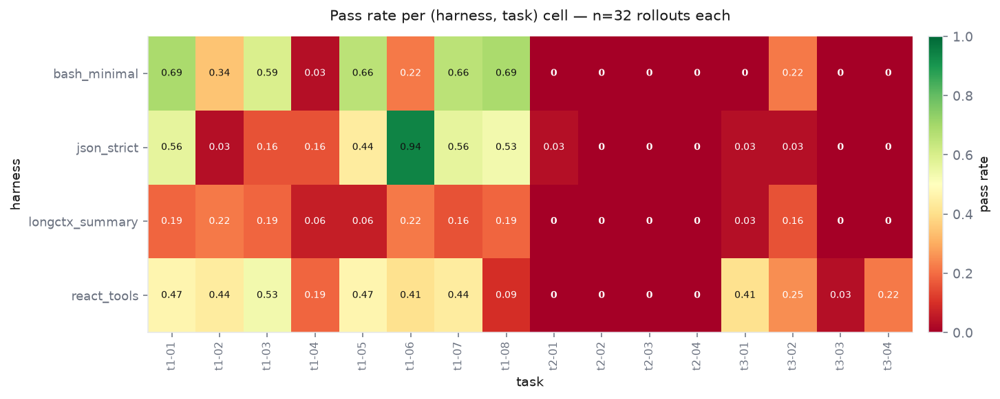

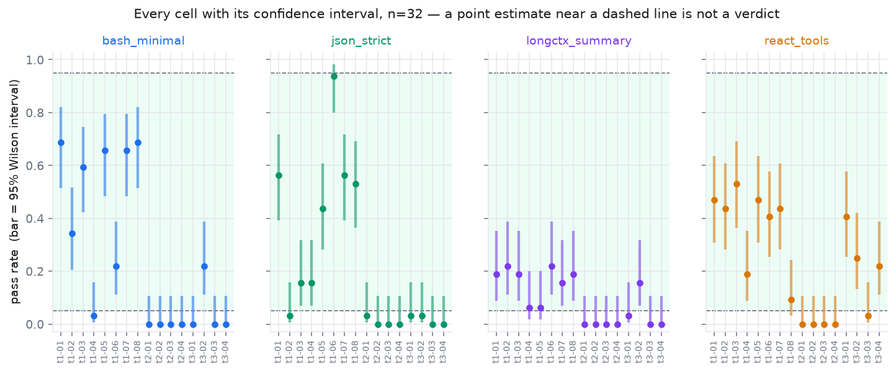

**The verdicts, old sample size against new — and the analytic signal curve that
says what "dead" would have to mean.**

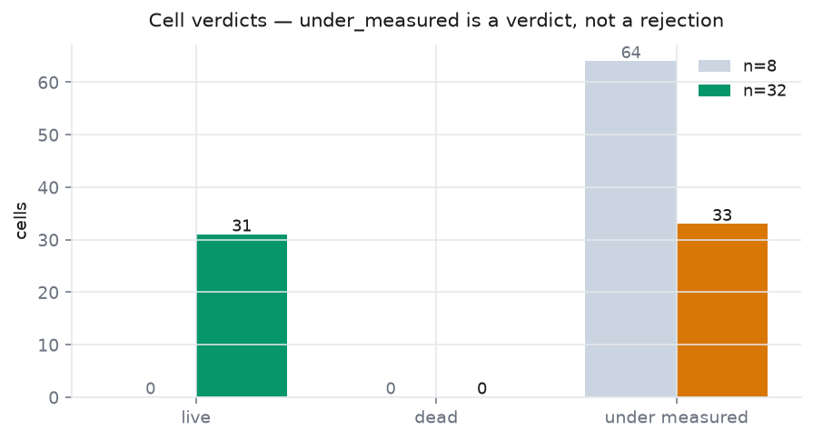

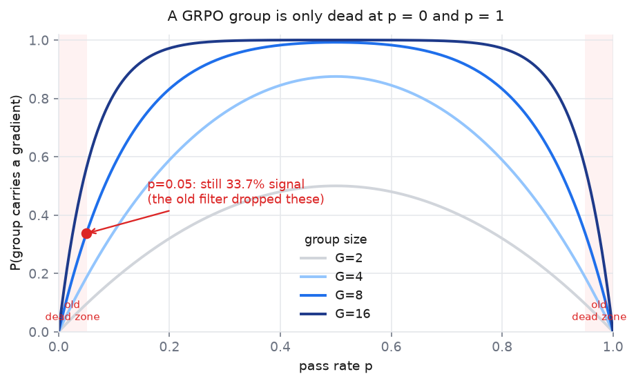

**Where each cell sits on the difficulty curve, and the mechanism behind the
zeros.**

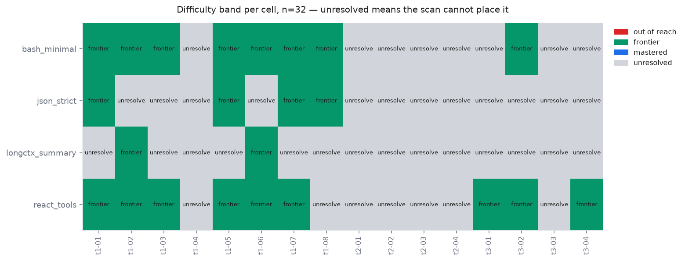

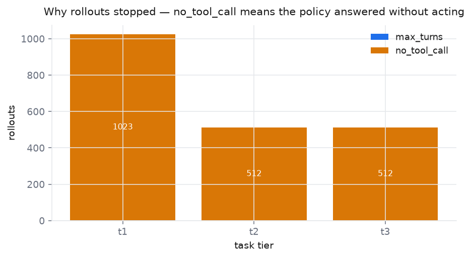

**Turn and tool-call behaviour, split by outcome and by tier.**

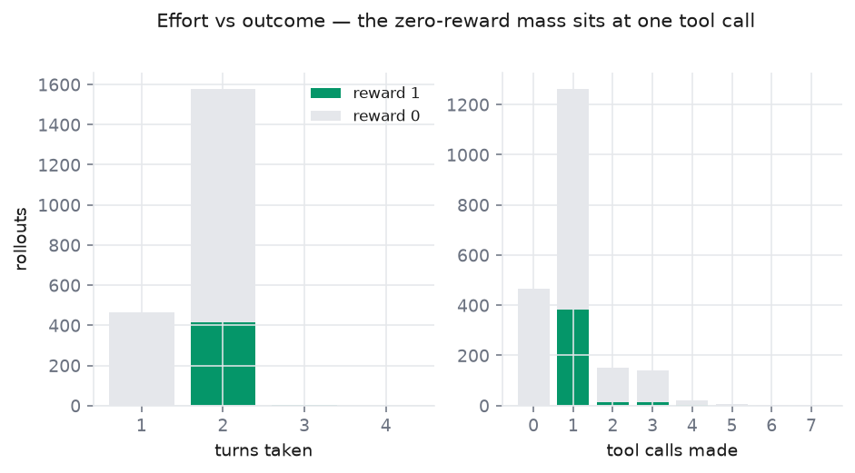

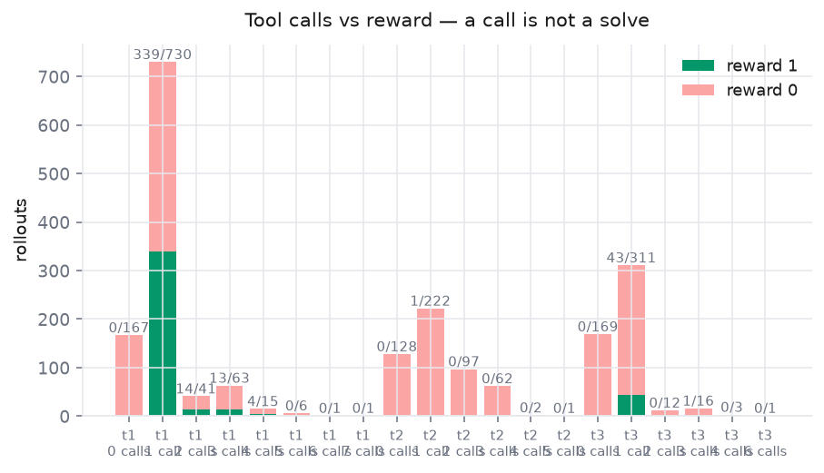

**The annealed budget, which is computed rather than measured, and the ledger it
governs.**

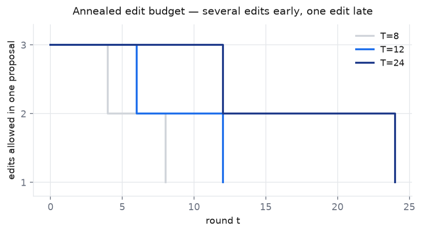

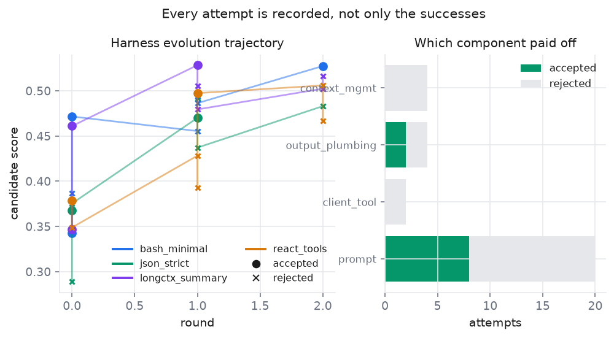

The ledger figure is drawn from whichever scoring mode has a ledger on disk, and
its title names the mode. That labelling is load-bearing: a replayed trajectory
and a measured one are both "a rising line", and only one of them means the
harness improved.

**The self-construction axes: gate outcomes on a generated batch, and the
training curve with zero-gradient steps marked.**

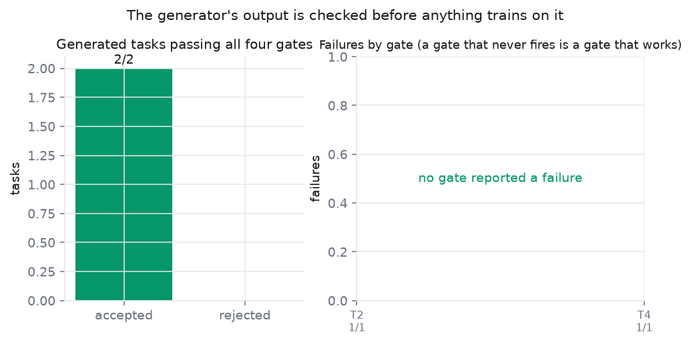

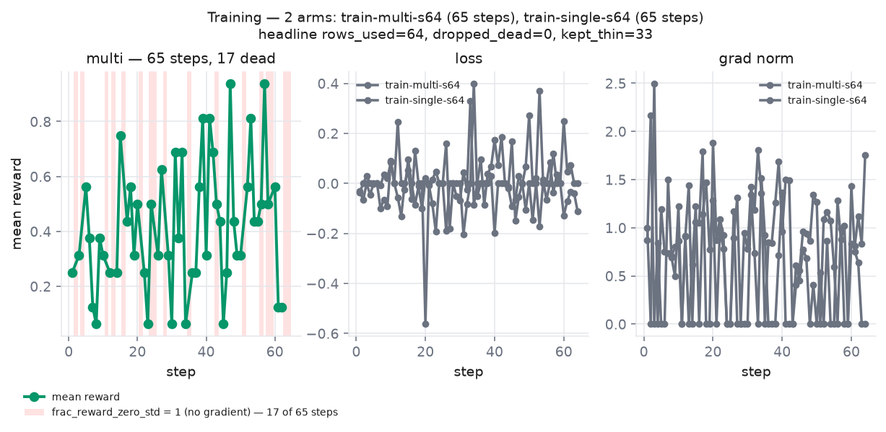

**The result itself — all three arms, and the gap each one leaves behind.**

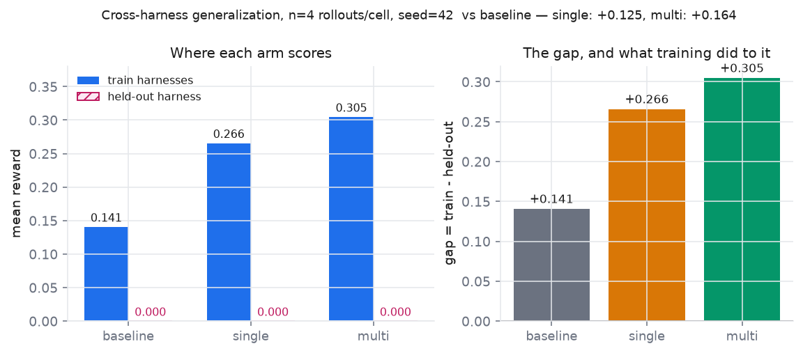

## The measurement

The headline number is a difference of differences:

```
gap = mean(reward | train harnesses) − mean(reward | held-out harness)
```

Read that as an absolute level it is worthless: a base model already has a gap.
So the repository measures three arms with one process, one seed, and shared
harness instances:

| arm | trained on | what it tells you |
| --- | --- | --- |
| baseline | nothing | the gap the base model already has |
| single | one harness | what overfitting one scaffold costs |
| multi | four harnesses | whether mixing them shrinks the held-out gap |

The ablation is `single` vs `multi`, both read against `baseline`. A raw gap
number without the baseline arm is a level, not a result.

**The two trained arms are matched on optimizer steps, not on epochs, and the
choice matters.** `single` sees 16 rows, `multi` sees 64 — the same 16 tasks
crossed with four harnesses — so an epoch-matched run would give `multi` four
times the gradient updates and any difference in the gap would be confounded
with a difference in training budget. Both arms therefore run the same
`--steps`, and `multi` sees each row once per four epochs of `single`. The
comparison is "same compute, different environment diversity", which is the
question the experiment asks; the alternative would answer "does training longer
help", which is not.

## Results

One process, one seed (42), shared harness instances, 5 harnesses × 8 held-out
tasks × 4 rollouts = **160 rollouts per arm, 480 total**. `n = 4` per cell.

| arm | train-harness reward | held-out reward | gap |
| --- | --- | --- | --- |
| baseline (no training) | 18/128 = **0.1406** | 0/32 = 0.0000 | **+0.1406** |
| `train-single-s64` | 34/128 = **0.2656** | 0/32 = 0.0000 | **+0.2656** |
| `train-multi-s64` | 39/128 = **0.3047** | 0/32 = 0.0000 | **+0.3047** |

**Training worked, on the harnesses it saw.** Both arms beat the baseline on the
train harnesses, and the effects are larger than sampling noise: single
`d = +0.1250`, `z = +2.49`; multi `d = +0.1641`, `z = +3.15`. The single arm's
mean reward rose `0.367 → 0.488 → 0.520 → 0.508` across the four quarters of its
64 steps, so it learned and then plateaued rather than merely drifting.

**The multi arm's curve is less clean, and it is worth saying so.** It rose the
same way — `0.227 → 0.313 → 0.441` — and then **fell back to 0.352** in its last
quarter. Its mean over all 64 steps (`0.333`) is *below* single's (`0.471`), while
its eval train-harness reward (`0.305`) is *above* single's (`0.266`). Those two
facts are not contradictory — the training mean includes the early steps where
four harnesses' worth of variance was being absorbed, and the eval reads only the
final checkpoint — but a last-quarter decline is not a plateau, and 16 steps per
quarter cannot separate a late-training regression from noise. The ablation
numbers below are from the final checkpoint, so if that checkpoint is a local dip
the multi arm's advantage is overstated. Nothing in this run rules that out.

**The headline contrast is not significant, and the arithmetic says why.**
`multi` beats `single` by `d = +0.0391`, `z = +0.69`. Because the held-out term
is 0 in *every* arm, `d_gap ≡ d_train` exactly — the gap difference is the train
difference with nothing subtracted. So the honest statement is:

> the observed direction favours multi-harness training, and the effect is
> **indistinguishable from zero** at this sample size. The repository's own
> pre-registered hypothesis is **not** supported, and also not refuted.

Wilson intervals on the train means make the resolution explicit:
baseline `[0.0908, 0.2114]`, single `[0.1968, 0.3482]`, multi `[0.2316, 0.3892]`.
Single and multi overlap across most of their range. Two numbers say how far off
the design was: at `n = 128` rollouts per arm the **minimum detectable effect** is
`d ≥ 0.1581`, and the observed effect is `0.0391` — a quarter of that. Reaching
80% power at the observed effect size needs **~2,094 rollouts per arm, 16×** the
eval that was run, which is not a laptop-sized experiment on this GPU. That is a
budget statement, not an excuse: the number is what it is, and the direction is
all this run can honestly report.

**And the held-out term is a floor effect, so the metric the protocol was built
around cannot be tested by this run at all.** `codex_style` scores 0/32 in the
baseline arm — the untrained model cannot score on it — which is why the gap
difference collapses onto the train difference. `0/32` has a Wilson interval of
`[0, 0.1072]`, verdict `under_measured`: consistent with "cannot do it" but also
with a true rate of 10%.

The cause is **not** the harness. It is fixed, regression-tested, and
`codex_style` still reads zero. A fresh `diag.py` transcript shows why: the model
emits a well-formed `apply_patch` call and passes the bare answer string where a
unified diff belongs.

```
parsed calls : [{'function': {'name': 'apply_patch', 'arguments': {'patch': 'reward is one'}}}]
tool apply_patch -> patch: **** Only garbage was found in the patch input.
```

Held fixed, `*** Add File: answer.txt\n+reward is one` scores **1.0** and a real
unified diff scores **1.0**; the bare string scores 0.0. So the held-out axis is
measuring *"can a 0.5B model emit a unified diff at all"*, which is a capability
question about the base model, not a generalization question about training. The
**correct fix is a second held-out harness whose submit path the base model can
already drive** — otherwise the held-out term stays pinned and no amount of
rollouts will unpin it.

**What this run does establish, stated plainly:**

* training on the harnesses it sees improves reward on those harnesses
  (`z = +2.49` and `+3.15` — real);
* the direction of the multi-vs-single effect is the predicted one, at `z = +0.69`
  — suggestive, not evidence;
* the pre-registered cross-harness generalization test **did not run**, because
  its held-out term is a floor effect;
* the GRPO signal arithmetic held up on a real run — see the `0.617` vs `0.6634`
  comparison above.

Three ways forward, in order of how much they would settle:

1. **Replace the held-out harness** with one the baseline can drive, so
   `gap = train − held_out` has a live second term. Cheap; unblocks the protocol.
2. **Power the train contrast** (~2,094 rollouts/arm) if the question is the
   0.0391 itself rather than the gap.
3. **Regenerate the suite** so frontier cells sit on the frontier — the task
   generator's job, per the T2 finding above.

## Reproducing

Requires Python 3.12+ and a Git-Bash shell on Windows. The core — harnesses,
tasks, verifier, the whole RSI layer, and every static guard — is
**dependency-free**, so the checks below run without installing torch.

```bash
git clone https://github.com/possibleme2026-lang/rsi-multi-harness-rl.git
cd rsi-multi-harness-rl

# core checks: no torch, no GPU
./run.sh scripts/guard_tool_surface.py
./run.sh tests/test_path_errors.py
./run.sh tests/test_shell_timeout.py
./run.sh tests/test_scan_tooling.py
./run.sh tests/test_verifier_modes.py
./run.sh tests/test_rsi_stats.py
./run.sh tests/test_rsi_generator.py
./run.sh tests/test_rsi_loop.py
./run.sh tests/smoke_env.py
```

The RSI loop itself needs no model in its default mode, so the generator,
the four gates, and the harness evolution can all be exercised on CPU:

```bash
./run.sh scripts/rsi_loop.py --rounds 6 --task-batch 30
./run.sh tools/check_figures.py
./run.sh tools/check_readme_i18n.py
```

`run.sh` is the supported entry point, not a convenience. It sets `APPDATA`, the
HuggingFace cache, and clears `PYTHONPATH`, because on Windows each of those
produces a *misleading* error rather than a missing-dependency error when wrong —
`from_pretrained` claiming there is no internet connection, or `import torch`
raising ModuleNotFoundError on a machine where torch is installed.

The full pipeline needs the RL stack (`trl` on the dev line; see
`pyproject.toml`) and a GPU:

```bash
pip install -e ".[rl,dev]"

bash pipeline.sh                    # scan -> train single -> train multi -> eval
STEPS=20 N_EVAL=4 bash pipeline.sh  # a smaller run
SKIP_SCAN=1 bash pipeline.sh        # reuse an existing difficulty scan
```

Everything lands in `outputs/` (override with `MULTIHARNESS_OUT`). The n=32 scan
is 2,048 rollouts; training and evaluation are longer.

| script | what it does |
| --- | --- |
| `scripts/probe.py` | capability probe + difficulty scan, writes `scan_all.json` |
| `scripts/rsi_loop.py` | both RSI axes: generate + gate tasks, evolve harnesses |
| `scripts/train.py` | one arm of the ablation (`--mode single` / `--mode multi`) |
| `scripts/eval.py` | baseline + both arms in one process, prints the ablation |
| `scripts/diag.py` | full un-truncated transcript for one (harness, task) |
| `scripts/errs_report.py` | classifies scan tool errors: harness defect vs model behaviour |
| `scripts/guard_tool_surface.py` | advertised tools must equal implemented tools |
| `scripts/merge_scan.py` | fold a partial rescan into an old dump, with invariant checks |

## Layout

```
src/multiharness/
  harnesses/core.py     BaseHarnessEnv, the verifier, the shell runner, path resolver
  harnesses/pool.py     the five harnesses
  tasks/suite.py        the 24 tasks, and the train/eval split
  rsi/task_gen.py       axis 1 — generate task, environment, and reference
  rsi/envgen.py         axis 4 — synthesise a *stateful environment*: the tool
                        dependency graph, the initial state, and the chain
  rsi/envtask.py        a task as a path through that graph, graded on the state
  rsi/harbor_export.py  the Harbor package for one such task
  rsi/env_adapter.py    the same task, in the shape the harness pool runs
  rsi/verifier_gen.py   axis 2 — generate the reward, in one of three modes
  rsi/validate.py       gates V1-V4
  rsi/harness_evolve.py axis 3 — descriptor edits, guard, judge
  rsi/ledger.py         append-only JSONL, annealed budget, prune, stall
  rsi/stats.py          Wilson intervals, GRPO signal, noise floor
  rsi/band.py           regret banding and the steering signal
  rsi/curriculum.py     the alpha-reward, and the plan that closes the loop
  rollout.py            a standalone re-implementation of TRL's tool-calling loop
  _bootstrap.py         repo root + artifact directory
scripts/                entry points (probe, rsi_loop, train, eval, guards,
                        harbor_local_run, env_batch_make, env_harness_smoke,
                        env_reward_ceiling, env_scan_report, guidance_shape_check)
tests/                  smoke tests and regression tests
tools/                  plotting, figure check, README i18n parity guard
docs/refs/              what was borrowed from RRSI, Dream-RSI, and the
                        environment-synthesis literature, and why
pipeline.sh             the full run, in dependency order
```

## Bugs worth documenting

Each was found by measurement disagreeing with expectation, and each has a
regression test. They are in the README because every one of them silently
corrupts a result rather than crashing.

**Every harness told the agent to write `answer.txt`, and 96 of 96 rollouts
scored 0.00 because of it.** This is the worst bug in this file: not because of
its size, but because it produced a *complete, plausible, entirely false*
capability result. Each harness appends a static `GUIDANCE` block — written for
string tasks, and correct for them — saying to submit by writing `answer.txt`.
A stateful environment task is graded on `state.json`, so a perfect solution
would have scored 0.0; and the block never mentioned `envtool`, so the agent's
only route to the environment was guessing tool names. The transcripts show
exactly that: `update_inventory_item_by_id: command not found`,
`cat /var/log/syslog`, `echo "set balance to closed"`.

The Harbor export path did not have this bug, because `_instruction_md` renders
a tool table. That table is built in `harbor_export` and never reaches the
harness pool — the pool reads a task *dict*, not a package — so the two paths
diverged and **only one of them was ever executed**. The fix is a per-task
`guidance` override that `core._instruction` prefers over the static block.

**The first fix did not fix it, and the number it was validated on went up.**
The override rendered the environment's commands as a bare list —
`envtool list_tickets`, `envtool set_state <id> <value>`. That reads as a *tool
list*, and the prompt already contains one, because the chat template renders the
harness's own tools as a schema block above the instruction. Given two lists of
that shape, the model merged them and called `envtool list_tickets` **as a tool
name**:

```
envtool list_tickets({'query': 'state=open'})
-> Tool envtool list_tickets not found. Available: ['bash']
```

Measured across the pool: **70% of all 96 rollouts** were that one shape, and the
model invented `list_accounts` and `list_items` on environments that have no such
command — it was answering the shape of the prompt, not its content. Meanwhile
the tool-call rate went 35.4% → **81.2%** and the pass rate stayed at exactly
`0.00`, because **a call to a non-existent tool is still a tool call**. The gate
meant to detect "the model can engage at all" was satisfied by the failure mode
it was supposed to catch. A gate a wrong call satisfies is not a gate.

The guidance now introduces the commands as *shell command lines*, names the
shell tool they are reached through, and shows the wrong shape explicitly as
wrong. `scripts/env_scan_report.py` classifies the shape of every call
(`no_call` / `bad_args` / `unknown_tool` / `query_only` / `wrong_target` /
`mutated_ok`) so the call rate can no longer be read as progress on its own —
which is how this was found at all. A matrix of zeros looks identical whether the
model never called a tool, called a non-existent one, or called the right one and
stopped.

**A package that audits clean and cannot run.** `audit_package` checked that
`environment/assets/tools.py` existed, was well-formed, and listed the right
tools — all true. It did not check that the tools were *dispatchable*, and two
were not: `restore` and `pin` were implemented in the in-process grader
(`envtask.apply_trace`) and missing from the exported program, so the exported
environment and the solution driving it had drifted. Measured: **0 of 30
packages executed**, `unknown tool: restore` on every one. The test suite was
green throughout, because a structural audit and a score comparison both keep
succeeding while the thing they describe is broken. The local runner caught it.
The lesson is the one this repository keeps relearning: **an unexecuted package
is a claim, not a benchmark.**

**The difficulty knob lied three times, in three different ways.** `n_steps` is
the environment axis's only difficulty knob, and each fix revealed the next
layer: (1) chains were padded with *queries*, which contribute no reference step
and no checkpoint, so a 4-step chain graded a 1-step solution; (2) chains were
padded with tools the reference *refuses to use* (`reset_log`, `bulk_update`), so
43% of tasks had a 4-step chain and a 1-step reference; (3) the ceiling itself
varied with an unrecorded draw, so `n_steps=5` was refused for "3 usable
mutators" on 27 of 60 seeds and "4 usable mutators" on 33 — the knob's
*legality* depended on a seed. The ladder is now 60/60 deterministic per
setting and 60/60 refused above the ceiling.

**A callable in a task dict made the batch unwritable.** `env_adapter` put a
`lambda` in the `env` key to point each rollout at its own state file — correct
in spirit, and it made `json.dumps` raise, so the environment batch could not be
written and the cross-harness gap could only ever be measured on string tasks.
The fix is a declarative template resolved at `reset`. The *dangerous* fix would
have been to drop the key: without `ENVTOOL_STATE` every rollout reads the same
default path, so all rollouts silently share one state file — an environment that
appears to work while coupling every rollout to every other.

**A subprocess deadlock worth 84 minutes of idle GPU.** The shell runner used
`subprocess.run(capture_output=True, timeout=...)`. When the timeout fires, that
kills the direct child and then drains the pipes — but a grandchild that inherited
the write end keeps them open, so the drain never sees EOF and blocks forever.
`TimeoutExpired` is not even raised, because the timeout already fired; the
*safety net itself* hangs. The symptom was "no output for 84 minutes" with the GPU
at 0%, and a timeout-only fix would not have helped. The runner now writes to a
temporary file, closes stdin, and kills the process tree.

**`Path(workdir) / ""` is the directory, not an error.** A model calling
`write_file(path="", content=...)` or `replace_in_file(path=".")` attempted a write
against the working directory itself, and the raw OS error leaked back as the
tool's result: `Permission denied` on Windows, `IsADirectoryError` on POSIX. The
message is platform-dependent, which is the real problem — it polluted the exact
axis the experiment measures, so a harness would have scored lower for a reason
having nothing to do with the model. The same investigation surfaced POSIX
absolute paths (`/config.txt`, `/Users/qwen/...`) silently retargeting outside the
workspace on Windows. All path-taking tools now share one resolver that rejects
empty paths, `.`, directory targets, and escapes with OS-independent messages.

**A generated reward that shipped a brute-forceable digest.** `verify_mode` was
drawn independently of the payload, so the generator produced `python_exit` on
three-character answers — the one combination `verifier_gen`'s own docstring
names as wrong, because `check_script` lands inside the agent's work directory.
Measured over 300 tasks at seed 0: **96 (32%) were affected**. Across eight seeds
the count runs 79–99 of 300, so the rate is seed-dependent; the seed is quoted
because the default (`--seed 11`) yields 91, not 96. The generator now asks
`recommend_mode` instead of trusting its parameter vector; 0 are affected, and an
explicit long-answer `python_exit` is still honoured. Fixing it exposed a second
defect in the same commit: `summarise_batch` counted `params["verify_mode"]`, so
after the fix the coverage report claimed 8 `python_exit` tasks when 1 existed —
it now reports what the tasks use, with the requested count beside it.

**A `DEAD` threshold that was a guess.** `stats.py`'s docstring said excluding the
signal band at zero passes takes "roughly `n >= 128`". The true boundary is **73**
(`wilson_interval(0, 73)[1] = 0.04999`; `n = 72` gives 0.0507). The gap is not
cosmetic: 73 rollouts is a laptop-sized scan, 128 is where you stop and redesign.
The docstring now states both boundaries and a test pins them.

**`rule_of_three_upper` used the wrong base.** It computed
`1 − confidence^(1/n)`, returning 0.0064 at `n=8` — 49× too small — while its own
docstring said 0.312. Found by arithmetic against the docstring. The correct base
is `1 − confidence`, and a test exists because the slip produces a
plausible-looking float.

**`classify_cell` would have called `0/32` live.** A `(hi − lo) <= 0.25` shortcut
accepted any narrow interval, including `[0, 0.107]` — which is narrow and
entirely outside the signal band. Replaced with containment **and** a width cap of
half the band.

**A third, related fix:** `errs_report.py` originally returned a *false-green*
verdict — "no harness defects" — while 25–27 raw OS errors sat in its catch-all
bucket. It now has an explicit OS-error class and fails the scan. A guard that
cannot fail is worse than no guard.

**A harness defect that read as a model failure — real, fixed, and not the
cause of the zero it was blamed for.**
`codex_style`'s `apply_patch` fallback built its shell command by appending
`|| echo '[error] patch tool unavailable or patch failed'` *after* the heredoc
terminator:

```bash
command -v patch >/dev/null 2>&1 && patch -p0 -f <<'__PATCH__'
<patch body>
__PATCH__
|| echo '[error] patch tool unavailable or patch failed'
```

A heredoc ends at its terminator, so the `||` became a line of its own and the
entire command was a bash **syntax error**. Any unified diff that reached the
shell came back as `syntax error near unexpected token '||'` and was never
applied. The harness's `*** Add File` shortcut masked it in casual testing —
that path returns before the shell is ever reached — so the tool was advertised,
registered, reachable, and never worked, which is exactly the failure
`guard_tool_surface.py` exists to prevent in the one place it cannot see.

The fix groups the heredoc-fed command in `{ ... }` so one `||` can legally
follow it, and reads the exit status from `_run_shell_rc` rather than parsing
prose — the same mistake `python_exit` made. A regression test asserts that a
valid diff is applied, the file appears, and the patched answer scores 1.0.

**The defect was real. It was also not why `codex_style` scored zero, and the
first draft of this section said it was.** That distinction matters, so it is
recorded rather than quietly edited out. Re-running the eval *after* the fix
reproduced `codex_style` at **0/8 in all three arms, baseline included** — so the
syntax error cannot have been the cause. A fresh `diag.py` run shows the actual
one:

```
decoded      : '<tool_call>{"name": "apply_patch", "arguments": {"patch": "reward is one"}}</tool_call>'
parsed calls : [{'function': {'name': 'apply_patch', 'arguments': {'patch': 'reward is one'}}}]
tool apply_patch -> patch: **** Only garbage was found in the patch input.
```

The model picks the right tool and the right argument *name*, and then puts the
bare answer string where a unified diff belongs. `patch` is correct to reject
that. Held everything else fixed, three payloads side by side:

| what is passed as `patch` | result |
| --- | --- |
| `*** Add File: answer.txt\n+reward is one` | **reward 1.0** |
| `reward is one` — what the model actually sends | 0.0, `Only garbage was found` |
| a real unified diff | **reward 1.0** |

The prompt does say `` `apply_patch` takes a unified-diff body``. A 0.5B model
does not emit one anyway. So the harness plumbing is fixed and the harness is
*not* the limiter — but the held-out harness still reads 0/8 for a reason that
has nothing to do with cross-harness generalization, which is the part that
invalidates the measurement. See Results.

**A floor effect that made the headline metric untestable.** `codex_style`
scores 0.0000 on the *baseline* arm, so the untrained model cannot score on it at
all. With the held-out term pinned at 0, `gap = train − held_out` can only ever
grow: "multi-harness training shrinks the gap" is not falsifiable by this
measurement, and the first full ablation reported "single-harness training
produced the smaller gap — hypothesis NOT supported" on the strength of it. That
conclusion is still unavailable. What the run does establish is in Results.

## Citing

If this repository is useful, cite the work it is built on:

```bibtex
@misc{mimo2026v26pro,
  title={MiMo-V2.6-Pro-RL},
  author={{Xiaomi MiMo Team}},
  year={2026},
  howpublished={\url{https://huggingface.co/XiaomiMiMo/MiMo-V2.6-Pro-RL}},
}
```

## License

Apache-2.0. See [LICENSE](LICENSE).
